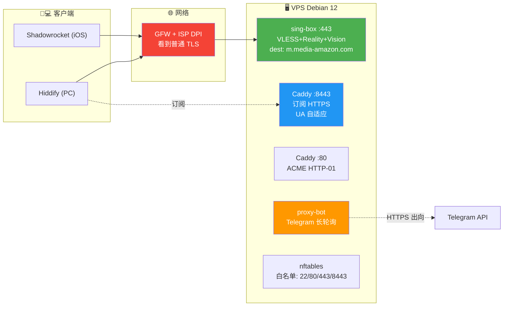

<div align="center">

# 🛡️ 高隐私 VLESS + Reality 代理 + Telegram 管理 Bot

**一台 VPS · 4 人共用 · 中文 GUI 管理 · Tor 跳板 SSH · 全程最小化日志**

从 0 到生产，含完整踩坑记录。


</div>

> [!IMPORTANT]
> 本教程仅用于学习计算机网络协议、TLS 指纹分析、系统加固的技术原理。请在合法合规前提下使用。
>
> 所有命令中尖括号占位符（如 `<VPS_IP>`、`<BOT_TOKEN>`）替换成你自己的值。

---

## 📑 目录

<table>
<tr>
<td valign="top">

**设计**
- [① 目标与威胁模型](#-1-目标与威胁模型)
- [② 架构总览](#%EF%B8%8F-2-架构总览)
- [③ 选型理由](#-3-选型理由)

</td>
<td valign="top">

**部署**
- [④ 部署步骤](#-4-部署步骤)
- [⑤ 踩坑记录](#-5-踩坑记录)
- [⑥ 维护与应急](#-6-维护与应急)
- [⑦ 已知限制](#-7-已知限制)

</td>
</tr>
</table>

---

## 🎯 1. 目标与威胁模型

### 1.1 目标

- 👥 4 人小群共用一台 VPS 翻墙（手机 + PC，并发上限 ~4）
- 🌐 网页 + AI + 轻量流媒体
- 🔒 **隐私最大化**：协议层、系统层、日志层全面最小化
- 🛡 **抗 GFW 主动探测**和**抗本地 ISP 深度包检测**

### 1.2 威胁模型（按重要度）

| 优先级 | 威胁 | 应对 |
|:---:|---|---|
| 🥇 | **GFW 主动探测 + 被动识别** | Reality 反向探测保护 + Vision flow 抗指纹 |
| 🥈 | **本地 ISP DPI** | 流量伪装成普通 HTTPS to amazon.com |
| 🥉 | **VPS 商窥探** | 私钥仅在 VPS RAM + Mac，流量内容 E2E 加密 |

### 1.3 明确不纳入的目标

> [!NOTE]
> - **元数据层匿名**：VPS 用真实支付方式购买，这层关联无法消除。本方案只覆盖**协议与系统层**的隐私。
> - **抗物理取证后追溯**：若 VPS 被搜查，无法完全零关联，但可大幅减害。

---

## 🏗️ 2. 架构总览



### 信任边界

| 角色 | 可见 | 不可见 |
|---|---|---|
| **你 + VPS** | 全部 | — |
| **VPS 商** | 加密 TCP 流量大小和时序 | 流量内容、目标域名 |
| **DuckDNS** | 子域名解析记录 | 流量内容 |
| **Telegram** | bot 命令文本 | 代理流量 |
| **GFW** | 去往 VPS IP 的 TLS 流量，SNI = amazon.com | 真实协议 |

---

## 🔬 3. 选型理由

### 3.1 协议：VLESS + Reality + Vision flow

<table>
<tr><th>组件</th><th>作用</th></tr>
<tr><td><b>VLESS</b></td><td>无加密开销的传输层（TLS 已经加密）</td></tr>
<tr><td><b>Reality</b></td><td>借用真实 TLS 握手，无需自有域名/证书；主动探测时透明转发到 dest server，GFW 看到的是真证书 + 真响应</td></tr>
<tr><td><b>Vision flow</b> (<code>xtls-rprx-vision</code>)</td><td>减少 TLS-in-TLS 特征，进一步抗指纹分析</td></tr>
</table>

### 3.2 Reality dest（SNI 伪装目标）

| 角色 | 值 | 理由 |
|---|---|---|
| 🥇 **主 SNI** | `m.media-amazon.com` | TLS 1.3 + X25519 + h2 ALPN ✅<br/>AWS CloudFront Anycast，IP 池庞大<br/>国内访问 Amazon 时该域名是正常浏览器流量<br/>Reality 教程冷门未被识别 |
| 🥈 **备 SNI** | `s0.awsstatic.com` | 同上属性，作为应急切换 |

<details>
<summary><b>❌ 淘汰的候选（点开查看）</b></summary>

| 候选 | 淘汰原因 |
|---|---|
| `apple.com` / `microsoft.com` / `cloudflare.com` | 默认教程，已被识别 |
| `store.steampowered.com` | 无 h2 ALPN |
| `cdn.discordapp.com` | 在 GFW 黑名单 |
| `addons.mozilla.org` | IP 较集中，无 CDN 池保护 |

</details>

**验证候选 SNI 是否合格**：

```bash
echo | openssl s_client -connect <CANDIDATE>:443 -servername <CANDIDATE> -alpn h2 2>&1 \
  | grep -E 'Protocol|Cipher|ALPN'
# 需要看到 TLSv1.3 + ALPN protocol: h2
```

### 3.3 组件清单

| 组件 | 用途 | 来源 |
|---|---|---|
| `sing-box` | VLESS+Reality 服务端 | SagerNet 官方 Debian 仓库 |
| `Caddy` | 订阅 HTTPS 服务 | Caddy 官方 Debian 仓库 |
| `python-telegram-bot` | 管理 bot | pip in venv |
| `nftables` | 防火墙 | 系统自带 |
| `fail2ban` | SSH 暴力防护 | apt |
| `tor` + `torsocks` | SSH 跳板 | brew (Mac) |

### 3.4 客户端

- 📱 **手机**：Shadowrocket（iOS，付费）
- 💻 **PC**：Hiddify Next（macOS / Windows / Linux 全平台免费）

订阅 URL 一条，UA 自适应返回正确格式。

---

## 🚀 4. 部署步骤

> [!TIP]
> **约定**：`ssh proxy-vps` 表示在 VPS 上执行；其他命令在 Mac/Linux 本地。
> 占位符 `<VPS_IP>`、`<BOT_TOKEN>` 等首次出现时见上下文，替换成你自己的值。

### 🔑 4.1 SSH 密钥化与密码禁用

<details open>
<summary><b>步骤展开</b></summary>

```bash
# Mac 上生成密钥（如已有可跳过）
ssh-keygen -t ed25519 -f ~/.ssh/id_ed25519 -N "" -C "my-mac-$(date +%Y%m)"

# 推公钥到 VPS（首次用密码登录）
ssh-copy-id -i ~/.ssh/id_ed25519.pub root@<VPS_IP>

# 加 SSH config 别名
cat >> ~/.ssh/config <<'EOF'

Host proxy-vps
    HostName <VPS_IP>
    User root
    IdentityFile ~/.ssh/id_ed25519
    IdentitiesOnly yes
EOF
chmod 600 ~/.ssh/config

# 测试密钥登录
ssh -o BatchMode=yes proxy-vps "echo SSH_KEY_OK"

# 禁用密码登录
ssh proxy-vps "sed -i.bak -E 's/^#?(PasswordAuthentication).*/\1 no/; \
  s/^#?(PermitRootLogin).*/\1 prohibit-password/; \
  s/^#?(PubkeyAuthentication).*/\1 yes/' /etc/ssh/sshd_config && \
  systemctl restart sshd"

# 再次验证
ssh -o BatchMode=yes proxy-vps "echo POST_RESTART_OK"
```

</details>

> [!WARNING]
> 别关掉你当前的 SSH 会话，等密钥登录二次验证通过再关，否则可能锁外。

### 🔥 4.2 防火墙白名单（nftables）

只开 22（SSH）、80（Caddy HTTP-01）、443（sing-box）、8443（Caddy 订阅）。

完整规则文件：[`scripts/nftables.conf`](scripts/nftables.conf)

```bash
ssh proxy-vps "apt install -y nftables && \
  systemctl enable --now nftables"
scp scripts/nftables.conf proxy-vps:/etc/nftables.conf
ssh proxy-vps "nft -f /etc/nftables.conf && nft list ruleset | grep -c 'tcp dport'"
```

**验证从外部**：

```bash
for p in 22 80 443 8443; do
  echo -n "port $p: "
  curl -o /dev/null -w '%{http_code}\n' --connect-timeout 5 http://<VPS_IP>:$p
done

# 白名单外的端口应该超时
curl -o /dev/null --connect-timeout 5 http://<VPS_IP>:9999 && echo "BAD - should timeout"
```

### 🛠 4.3 系统加固

<details open>
<summary><b>4.3.1 fail2ban</b></summary>

```bash
ssh proxy-vps "apt install -y fail2ban && cat > /etc/fail2ban/jail.local <<'EOF'
[sshd]
enabled  = true
port     = 22
maxretry = 5
bantime  = 1h
findtime = 10m
EOF
systemctl enable --now fail2ban"
```

</details>

<details open>
<summary><b>4.3.2 journald volatile（日志只存内存）</b></summary>

```bash
ssh proxy-vps "sed -i 's/^#\?Storage=.*/Storage=volatile/' /etc/systemd/journald.conf && \
  rm -rf /var/log/journal && \
  systemctl restart systemd-journald"
```

> [!CAUTION]
> `Storage=volatile` **要求** `/var/log/journal/` 目录**不存在**才生效，否则 journald 仍会写入它。**删目录 + 重启服务两步缺一不可。**

</details>

<details open>
<summary><b>4.3.3 bash_history → /dev/null</b></summary>

```bash
ssh proxy-vps "rm -f /root/.bash_history && ln -s /dev/null /root/.bash_history"
```

</details>

<details>
<summary><b>4.3.4 自动安全补丁</b></summary>

```bash
ssh proxy-vps "apt install -y unattended-upgrades && \
  dpkg-reconfigure -plow unattended-upgrades"
```

</details>

### 📦 4.4 安装 sing-box

```bash
ssh proxy-vps "curl -fsSL https://sing-box.app/gpg.key | gpg --dearmor -o /etc/apt/keyrings/sagernet.gpg && \
  echo 'deb [signed-by=/etc/apt/keyrings/sagernet.gpg] https://deb.sagernet.org/ * *' > /etc/apt/sources.list.d/sagernet.list && \
  apt update && apt install -y sing-box && \
  sing-box version"
```

准备配置目录：

```bash
ssh proxy-vps "mkdir -p /etc/sing-box && \
  chown root:sing-box /etc/sing-box && chmod 750 /etc/sing-box"
```

### 🔐 4.5 生成 Reality 密钥与初始用户

```bash
ssh proxy-vps '
cd /etc/sing-box

# Reality 密钥对
sing-box generate reality-keypair | tee /tmp/kp.txt
grep PrivateKey /tmp/kp.txt | awk "{print \$2}" > reality.key
grep PublicKey  /tmp/kp.txt | awk "{print \$2}" > reality.pub
chown root:sing-box reality.key reality.pub
chmod 640 reality.key; chmod 644 reality.pub
rm /tmp/kp.txt

# clash_api secret
openssl rand -hex 16 > clash_secret
chown root:sing-box clash_secret
chmod 640 clash_secret

# 初始用户行: name|uuid|short_id|sub_token
NAME=me
UUID=$(sing-box generate uuid)
SID=$(openssl rand -hex 4)
TOKEN=$(openssl rand -hex 16)
echo "${NAME}|${UUID}|${SID}|${TOKEN}" > users.txt
chown root:sing-box users.txt
chmod 640 users.txt
'
```

### ⚙️ 4.6 配置生成器 gen.sh

`users.txt` 是"真理源"，`gen.sh` 把它转成 sing-box 服务端配置 + 每用户客户端订阅。

完整代码：[`scripts/gen.sh`](scripts/gen.sh)

支持的子命令：

| 命令 | 作用 |
|---|---|
| `generate` | 重新生成 sing-box config + 所有用户订阅 |
| `add <name>` | 新增用户，输出订阅 URL |
| `revoke <name>` | 吊销用户 |
| `list` | 列出所有用户 |
| `rotate` | 全量轮换 Reality 密钥 + short_id + token |
| `switch-sni` | 主备 SNI 互换 |
| `show-sub <name>` | 输出指定用户的订阅 URL |

部署：

```bash
scp scripts/gen.sh proxy-vps:/opt/proxy-sub/gen.sh
ssh proxy-vps "chmod +x /opt/proxy-sub/gen.sh && /opt/proxy-sub/gen.sh generate"
```

启动 sing-box：

```bash
ssh proxy-vps "systemctl enable --now sing-box && \
  ss -tlnp | grep ':443'"
```

### 🧪 4.7 验证 Reality 反向探测保护

GFW 主动探测时会用异常 TLS Client Hello 试图识别代理。Reality 收到这种握手会**透明转发到 dest server**，外面看不出区别。

```bash
echo | openssl s_client -connect <VPS_IP>:443 -servername m.media-amazon.com 2>&1 \
  | grep -E 'subject|issuer'
```

✅ 应当看到真实的 `*.media-amazon.com` 证书（`CN=*.media-amazon.com`, `Issuer=Amazon RSA 2048 M0X`）
❌ 如果看到自签证书或连接被拒，说明 Reality 配置错了

### 🌐 4.8 DuckDNS 子域名

注册 https://www.duckdns.org（GitHub OAuth 登录），创建子域名，记下 token。

```bash
ssh proxy-vps '
mkdir -p /etc/duckdns
echo "<DUCKDNS_SUBDOMAIN>" > /etc/duckdns/domain
echo "<DUCKDNS_TOKEN>"     > /etc/duckdns/token
chmod 600 /etc/duckdns/*

cat > /etc/duckdns/update.sh <<EOF
#!/bin/bash
DOMAIN=\$(cat /etc/duckdns/domain)
TOKEN=\$(cat /etc/duckdns/token)
curl -sk "https://www.duckdns.org/update?domains=\${DOMAIN}&token=\${TOKEN}&ip="
EOF
chmod +x /etc/duckdns/update.sh
/etc/duckdns/update.sh
'
```

<details>
<summary><b>systemd timer 每 6 小时同步</b></summary>

```ini
# /etc/systemd/system/duckdns.service
[Unit]
Description=DuckDNS update
[Service]
Type=oneshot
ExecStart=/etc/duckdns/update.sh

# /etc/systemd/system/duckdns.timer
[Unit]
Description=DuckDNS update timer
[Timer]
OnBootSec=2min
OnUnitActiveSec=6h
Persistent=true
[Install]
WantedBy=timers.target
```

```bash
ssh proxy-vps "systemctl enable --now duckdns.timer"
```

</details>

### 🔒 4.9 Caddy 订阅 HTTPS 服务

完整配置：[`scripts/Caddyfile`](scripts/Caddyfile)

```bash
# 装 Caddy
ssh proxy-vps "apt install -y debian-keyring debian-archive-keyring apt-transport-https && \
  curl -1sLf 'https://dl.cloudsmith.io/public/caddy/stable/gpg.key' | gpg --dearmor -o /usr/share/keyrings/caddy-stable-archive-keyring.gpg && \
  curl -1sLf 'https://dl.cloudsmith.io/public/caddy/stable/debian.deb.txt' | tee /etc/apt/sources.list.d/caddy-stable.list && \
  apt update && apt install -y caddy"

# 部署配置
scp scripts/Caddyfile proxy-vps:/etc/caddy/Caddyfile
ssh proxy-vps "systemctl restart caddy && sleep 30 && \
  journalctl -u caddy --no-pager | grep -i 'certificate obtained'"
```

> [!CAUTION]
> 一开始用 tls-alpn-01 challenge 会失败（443 被 sing-box 占），Caddy 自动 fallback 到 HTTP-01（端口 80）才能成功。**这是为什么 nftables 必须放行 80。**

### 📲 4.10 客户端联调

订阅 URL 格式：

```
https://<DUCKDNS_SUBDOMAIN>.duckdns.org:8443/sub/<SUB_TOKEN>
```

**Shadowrocket**：右上 `+` → `Subscribe` → URL 粘贴 → 保存 → 下拉刷新 → 节点出现 → 主开关打开。

**Hiddify Next**：

> [!NOTE]
> GFW 在某些时段会主动 RST `duckdns.org:8443` 上的 TLS Client Hello（间歇性，非永久）。如果导入失败，绕开订阅 URL，从你 Mac 通过 SSH 拉 JSON：

```bash
ssh proxy-vps "curl -sk -A 'Hiddify' --resolve <DUCKDNS_SUBDOMAIN>.duckdns.org:8443:127.0.0.1 \
  https://<DUCKDNS_SUBDOMAIN>.duckdns.org:8443/sub/<SUB_TOKEN>" > ~/Downloads/cfg.json

cat ~/Downloads/cfg.json | pbcopy  # macOS 把 JSON 推剪贴板
```

然后 Hiddify → `+` → `从剪贴板导入`。

> [!IMPORTANT]
> Hiddify 在 macOS 上**必须切到 VPN 模式**才能正常工作（"仅代理"模式下首次导入会因找不到 core RPC 端口失败）。VPN 模式需要授予系统 Network Extension 权限（首次启动弹窗）。

### 🤖 4.11 Telegram 管理 Bot

#### 4.11.1 创建 bot

1. Telegram 私聊 [`@BotFather`](https://t.me/BotFather) → `/newbot` → 起名 → 得 token
2. 获取自己的 Chat ID：私聊 [`@userinfobot`](https://t.me/userinfobot) → 看 ID

#### 4.11.2 部署

```bash
ssh proxy-vps '
mkdir -p /opt/proxy-bot
cd /opt/proxy-bot
python3 -m venv venv
./venv/bin/pip install python-telegram-bot==21.11.1 httpx==0.28.1

cat > config.json <<EOF
{
  "bot_token": "<BOT_TOKEN>",
  "owner_chat_id": <OWNER_CHAT_ID>,
  "clash_api_url": "http://127.0.0.1:18090",
  "clash_secret_file": "/etc/sing-box/clash_secret",
  "users_file": "/etc/sing-box/users.txt",
  "gen_script": "/opt/proxy-sub/gen.sh",
  "stats_db": "/opt/proxy-bot/stats.db",
  "sing_box_config": "/etc/sing-box/config.json",
  "alert_thresholds": {"daily_total_gb": 200}
}
EOF
chmod 600 config.json
'

scp scripts/bot.py scripts/stats.py proxy-vps:/opt/proxy-bot/
scp scripts/proxy-bot.service proxy-vps:/etc/systemd/system/

ssh proxy-vps "systemctl daemon-reload && \
  systemctl enable --now proxy-bot && \
  systemctl is-active proxy-bot"
```

代码：[`scripts/bot.py`](scripts/bot.py)、[`scripts/stats.py`](scripts/stats.py)、[`scripts/proxy-bot.service`](scripts/proxy-bot.service)

#### 4.11.3 Bot 功能

<table>
<tr>
<th>分类</th>
<th>按钮</th>
</tr>
<tr>
<td><b>状态</b></td>
<td>📊 状态 · 👤 在线 · 📋 用户列表</td>
</tr>
<tr>
<td><b>流量</b></td>
<td>📈 今日 · 📈 本周 · 📈 本月</td>
</tr>
<tr>
<td><b>安全</b></td>
<td>🎯 IP 纯净度 · 🛡 Reality 检测 · 🔐 证书到期</td>
</tr>
<tr>
<td><b>密钥</b></td>
<td>🔄 切换 SNI · 🔁 轮换密钥</td>
</tr>
<tr>
<td><b>运维</b></td>
<td>💾 磁盘 · 📝 日志 · 📦 备份 · ⏸ 重载 · 🔃 重启</td>
</tr>
</table>

**自动告警**：

| 事件 | 频率 | 说明 |
|---|---|---|
| 服务异常 | 60s | sing-box / Caddy 挂了 |
| SSH 登录 | 60s | 每次成功登录推送源 IP |
| Reality 反向探测失效 | 6h | 自动 SNI 检测 |
| 证书 14 天内到期未续 | 12h | Let's Encrypt 监控 |
| 日总流量 > 200GB | 每天 23:00 北京 | 防滥用 |
| 每日小结 | 每天 00:30 北京 | 总流量摘要 |

> [!WARNING]
> **关于 per-user 流量统计**：sing-box 官方 Debian 包的 clash_api `/connections` **不暴露 VLESS 用户身份**（metadata 里只有 sourceIP/destinationIP/type，没有 inboundUser）。
>
> 四个选项：
> 1. ✅ **接受只看总量**（本教程的选择）— 信号足以发现滥用
> 2. 每用户独立 inbound + 独立端口 — 攻击面大，破坏单端口伪装
> 3. sourceIP 启发式映射 — 朋友 IP 漂移噪声大
> 4. 自编译 sing-box 加 `with_v2ray_api` tag — 失去 apt 自动安全更新
>
> 强需要按人统计 → 选 4；否则 → 选 1。

### 🧅 4.12 Tor 跳板 SSH

Mac 端：

```bash
brew install tor torsocks
brew services start tor
sleep 10

# 验证 Tor SOCKS5 工作
curl -sx socks5h://127.0.0.1:9050 https://check.torproject.org/api/ip
# 应当看到 {"IsTor":true,"IP":"<Tor 出口 IP>"}
```

修改 `~/.ssh/config`：

```ssh
Host proxy-vps
    HostName <VPS_IP>
    User root
    IdentityFile ~/.ssh/id_ed25519
    IdentitiesOnly yes
    ProxyCommand /usr/bin/nc -X 5 -x 127.0.0.1:9050 %h %p
```

> [!CAUTION]
> **不要用 `torsocks nc`**：macOS SIP 保护 `/usr/bin/nc`，torsocks 的 `DYLD_INSERT_LIBRARIES` hook 会被拒。
>
> 直接用 `nc -X 5 -x 127.0.0.1:9050` 走 nc 内置 SOCKS5 即可，**完全绕过 torsocks**。

测试：

```bash
time ssh proxy-vps "echo TOR_SSH_OK"
# 应 5-15 秒成功

# VPS 端确认源 IP 是 Tor 出口（不是你家庭 IP）
ssh proxy-vps "journalctl _COMM=sshd --since '2 min ago' | grep 'Accepted publickey' | tail -1"
```

### 🧹 4.13 收尾清理与备份

```bash
# 在 Telegram 点 📦 备份 触发，bot 返回路径
# 然后 scp 到本地
mkdir -p ~/Documents/proxy-backups
scp proxy-vps:/opt/proxy-sub/backups/proxy-backup-YYYYMMDD.tar.gz ~/Documents/proxy-backups/

# 清空 onboarding 期间可能残留的家庭 IP 日志
ssh proxy-vps '
find /var/log -name "auth.log*" -delete
find /var/log -name "wtmp*"  -exec sh -c "cat /dev/null > {}" \;
find /var/log -name "btmp*"  -exec sh -c "cat /dev/null > {}" \;
rm -rf /var/log/journal/*
journalctl --rotate
journalctl --vacuum-time=1s
systemctl restart systemd-journald
'
```

---

## 🪲 5. 踩坑记录

<details>
<summary><b>5.1 sing-box 1.13 没有 <code>with_v2ray_api</code> build tag</b></summary>

**错误**：`FATAL create v2ray-server: v2ray api is not included in this build, rebuild with -tags with_v2ray_api`

**原因**：SagerNet 官方 Debian 包不带这个 tag。

**解决**：删除 config 里 `experimental.v2ray_api` 整段，只保留 `clash_api`。统计走 clash_api `/connections` 轮询（5% 短连漏算可接受）。

</details>

<details>
<summary><b>5.2 Caddy ACME tls-alpn-01 失败</b></summary>

**错误**：`no application protocol` on port 443

**原因**：443 被 sing-box 占用，Caddy 无法在 443 起 tls-alpn-01 challenge listener。

**解决**：让 Caddy fallback 到 HTTP-01（端口 80）。nftables 必须放行 80。

</details>

<details>
<summary><b>5.3 SSH 密钥登录被拒（首次）</b></summary>

**错误**：推完公钥仍要求密码。

**原因**：很多 VPS 镜像默认 `PubkeyAuthentication no`。

**解决**：明确 sed 设 `PubkeyAuthentication yes`。

</details>

<details>
<summary><b>5.4 macOS 系统设置找不到"高级"代理</b></summary>

新版 macOS（Ventura+）路径变了：

> **系统设置 → 网络 → 你当前的网络旁 `详细信息…` → 左侧 `代理`**

</details>

<details>
<summary><b>5.5 macOS torsocks 被 SIP 拦截</b></summary>

**错误**：`/usr/bin/nc is located in a directory protected by Apple's System Integrity Protection`

**原因**：torsocks 用 `LD_PRELOAD`/`DYLD_INSERT_LIBRARIES` hook，SIP 拒绝 hook 系统目录下的二进制。

**解决**：用 nc 内置的 SOCKS5 支持 `nc -X 5 -x 127.0.0.1:9050`，根本不需要 torsocks 介入。

</details>

<details>
<summary><b>5.6 Hiddify "仅代理服务"模式下首次导入订阅失败</b></summary>

**错误**：`Connection refused, address = 127.0.0.1 port = <random>`

**原因**：Hiddify 的 Flutter 界面去连内部 core 进程的 RPC 端口，但仅代理模式下 core 没启动（VPN 模式需要 helper 启动 core）。

**解决**：切到 VPN 模式（系统授权 Network Extension），或手动从 SSH 拉 JSON 用剪贴板/文件导入。

</details>

<details>
<summary><b>5.7 journald Storage=volatile 不生效</b></summary>

**现象**：改了 `journald.conf` 但 `/var/log/journal/` 仍在被写入。

**原因**：systemd-journald 的逻辑是「如果 `/var/log/journal/` 存在，就用持久存储；只有目录不存在时 volatile 才生效」。

**解决**：`rm -rf /var/log/journal/<machine-id>` + `systemctl restart systemd-journald`。

</details>

<details>
<summary><b>5.8 clash_api <code>/connections</code> 不含 user 字段</b></summary>

参见 §4.11.3。最终选择只统计总流量。

</details>

<details>
<summary><b>5.9 GFW 间歇性 RST 订阅 URL</b></summary>

**现象**：从中国家庭宽带 `curl https://<duckdns>.duckdns.org:8443/...` 偶尔被 RST，几分钟后又通。Shadowrocket 在 4G 上没这个问题。

**原因**：duckdns 子域名 + 非标准端口 8443 + 国外 IP 的组合在某些时段被 ISP/GFW 临时干扰。

**解决**：朋友分发不依赖订阅 URL，改用 SSH 拉 JSON + 剪贴板/文件导入。代理本体 443 上的 Reality 流量不受影响。

</details>

---

## 🔧 6. 维护与应急

### 6.1 日常

| 频率 | 操作 |
|---|---|
| 自动 | `unattended-upgrades` 系统补丁 |
| 自动 | bot 自检并告警 |
| **半年** | Telegram 发 🔁 轮换密钥 |
| **每月** | Telegram 发 📦 备份 + scp 到本地 |

正常运行无需登录 VPS。

### 6.2 应急：VPS IP 被封

**判断**：所有用户都连不上，国内 ping VPS 不通，国外 ping 通。

**修复阶梯**：


### 6.3 应急：用户设备丢失

```bash
/revoke <name>     # 立刻吊销
/add <new_name>    # 重新发新订阅
```

不影响其他用户。

### 6.4 完整重建

```bash
tar xzf proxy-backup-YYYYMMDD.tar.gz -C /
systemctl restart sing-box caddy proxy-bot
# 5 分钟恢复到原状（IP 不同，需要重新分发订阅）
```

---

## ⚠️ 7. 已知限制

| 限制 | 原因 |
|---|---|
| 无 per-user 流量统计 | sing-box 官方 clash_api 不暴露用户 |
| 无访问目标日志 | 设计如此（隐私优先） |
| 半年密钥轮换需要重新分发 | Reality 公钥换了，老客户端连不上 |
| 订阅 URL 偶尔被 GFW RST | 8443 + duckdns 组合，已用 SSH 拉 JSON 兜底 |
| Tor SSH 首连 5-15 秒 | Tor 网络特性，正常运行后心跳保持快 |

---

## 📂 文件清单

```
scripts/
├── gen.sh              # 配置生成器（236 行）
├── bot.py              # Telegram bot（617 行）
├── stats.py            # 流量统计模块（151 行）
├── Caddyfile           # Caddy 订阅服务
├── nftables.conf       # 防火墙规则
└── proxy-bot.service   # systemd unit
```

---

<div align="center">

### 📜 License

[MIT](LICENSE) — 仅用于学习计算机网络与系统安全技术原理

**⚡ 如果这个教程对你有帮助，给个 ⭐ 吧**

</div>
